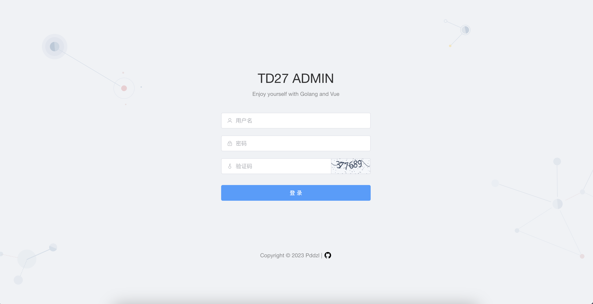
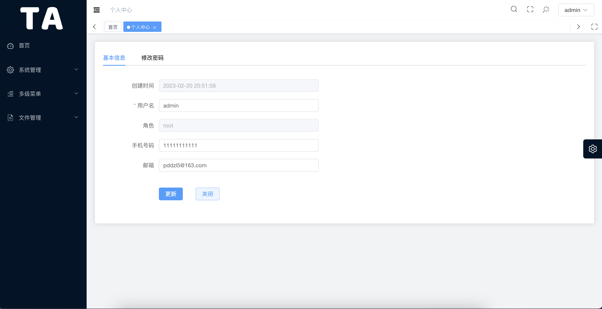
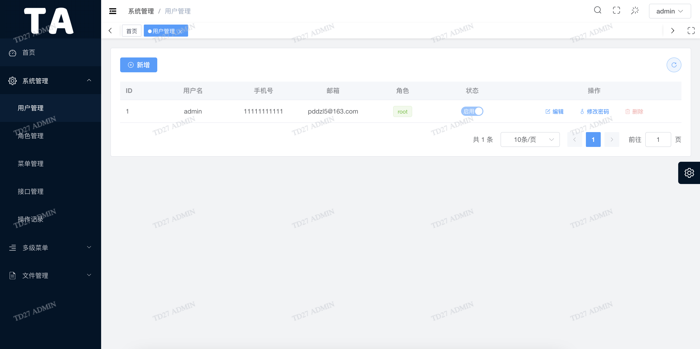
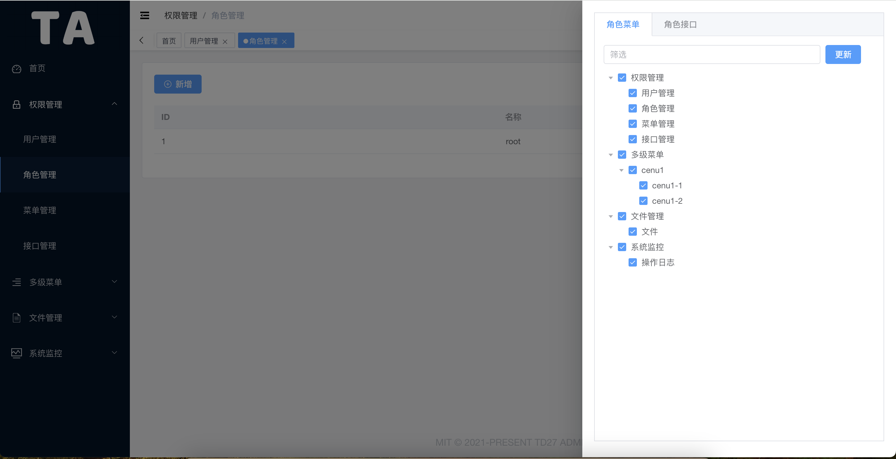
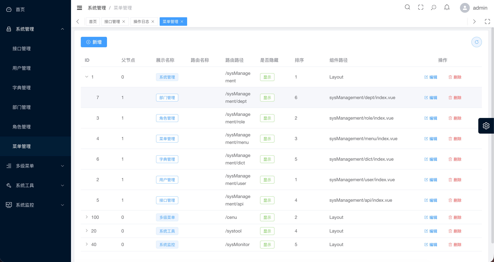
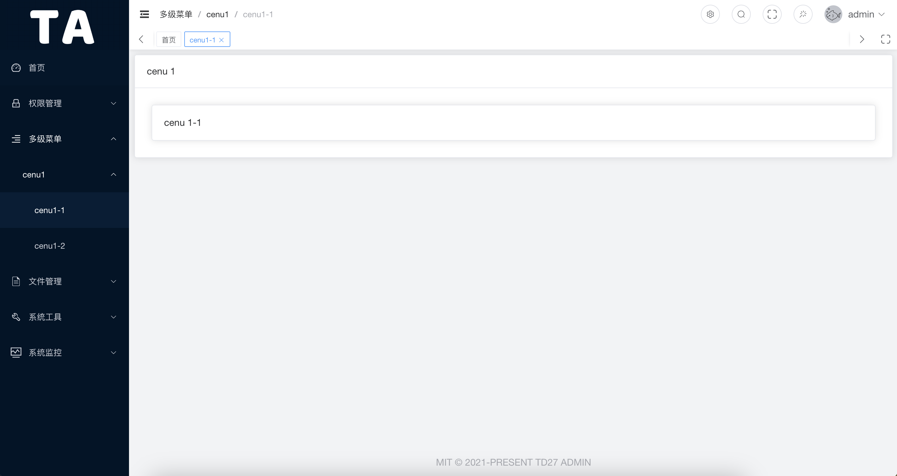
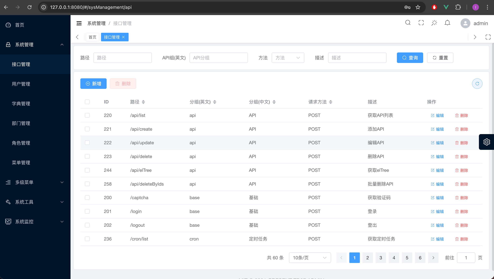
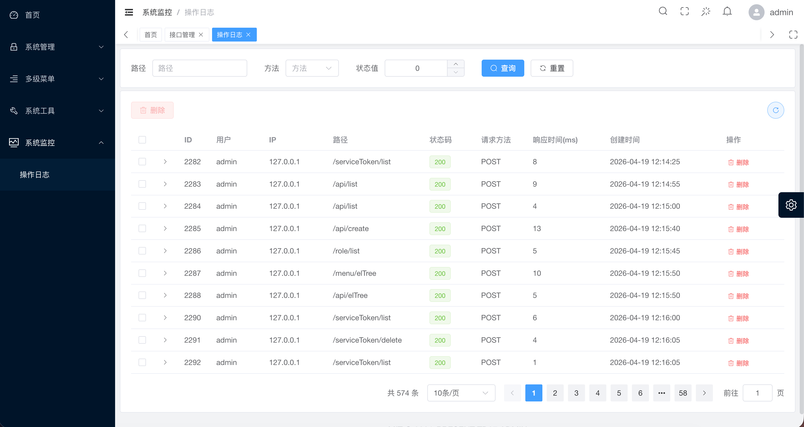

<div align="center">
  <h1>TD27 Admin</h1>
  <h4>A Golang Rapid Development Framework Based on Gin + Vue3</h4>
  <span>English | <a href="./README.zh-CN.md">中文</a></span>
</div>

## Platform Overview

* Frontend tech stack: TypeScript, Vue3, Element-Plus, Vite, Pinia
* Backend tech stack: Golang, Gin, Gorm, MySQL, Redis, Casbin

## Built-in Features

- User Management: Full CRUD and lifecycle management for system accounts, including role binding and status toggling.

- Role Management: Permission entities that map roles to menus and API endpoints.

- Menu Management: Role-based dynamic routing and menu generation.

- API Management: Role-level access control for backend API routes.

- Operation Logs: Records user operations and request traces for auditing.

- Scheduled Tasks: Supports cron-like task configuration via both YAML and UI-driven management.

- File Management: Implements backend file storage with upload, retrieval, and deletion APIs.

- Dictionary Management: Nested dictionary definitions for unified data mapping and frontend rendering.

## Run

Default account / password:

`admin/123456`

Clone the project
`git clone https://github.com/pddzl/td27-admin.git`

### Frontend

```bash
# Requirements
1. Install recommended plugins from the .vscode directory
2. Node version 22+
3. pnpm version 8.x

# Enter project directory
cd web

# Install dependencies
pnpm i

# Start development server
pnpm dev

# Preview staging environment
pnpm preview:stage

# Preview production environment
pnpm preview:prod

# Build staging environment
pnpm build:stage

# Build production environment
pnpm build

# Format code
pnpm lint
```

### Backend

```bash
# Requirements
1. Go >= 1.25

# Enter server directory
cd server

# Use go mod and install dependencies
go generate

# Build
go build -o server cmd/server/main.go

# Run the binary
./server
```

#### Directory Structure
```shell
├── cmd                      # Main application entry points (one folder per binary)
│   └── server               # Main HTTP server entry (main.go)
│
├── configs                  # Configuration files (YAML/JSON), config templates
│
├── docs                     # API docs, Swagger files, architecture docs
│
├── internal                 # Private application code (not for import by other modules)
│   ├── api                  # Request handlers (Gin handlers / controllers)
│   ├── core                 # Core startup logic (config load, logger, DB, server setup)
│   ├── global               # Global variables (DB, Redis, Config, Logger, etc.)
│   ├── initialize           # Init functions (router setup, config init, cron init)
│   ├── middleware           # Gin middleware
│   ├── model                # Data models: entity, request, response, VO, DTO
│   ├── pkg                  # Shared utilities (tools, common helpers, not business logic)
│   ├── router               # Router groups & route registration
│   └── service              # Business logic & database operations (service layer)
│
├── log                      # Application logs
│
├── resource                 # Static resources (images, attachments, templates)
│   └── upload               # File upload target directory
│
└── scripts                  # Shell scripts (build, deploy, maintenance)

```

**<u>If you deploy manually, you must create a database `td27` and import the initialization data.
SQL file location: `./docker-compose/mysql/init/init.sql` </u>**

## swagger

```bash
cd server
swag init -g cmd/server/main.go -o docs --parseDependency --parseInternal
```

`Access Swagger UI`

```bash
http://localhost:8888/swagger/index.html
```

## One-Click Installation

Docker Compose version must be V2

```bash
git clone https://github.com/pddzl/td27-admin
cd td27-admin
docker compose -f docker-compose/compose.yml build
docker compose -f docker-compose/compose.yml up -d
```

Then open in browser: `http://ip:8500`

## Project Preview

<table>
  <tr>
    <td></td>
    <td></td>
  </tr>
  <tr>
    <td></td>
    <td></td>
  </tr>
  <tr>
    <td></td>
    <td></td>
  </tr>
  <tr>
    <td></td>
    <td></td>
  </tr>
</table>

## Acknowledgements
+ Frontend scaffold based on [v3-admin-vite](https://github.com/un-pany/v3-admin-vite)

## 📄 License

[MIT](./LICENSE)

Copyright (c) 2022-present [pddzl](https://github.com/pddzl)
