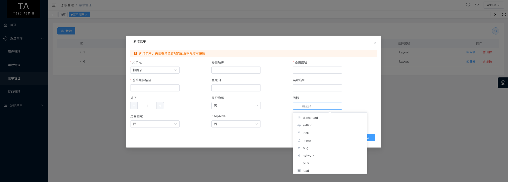
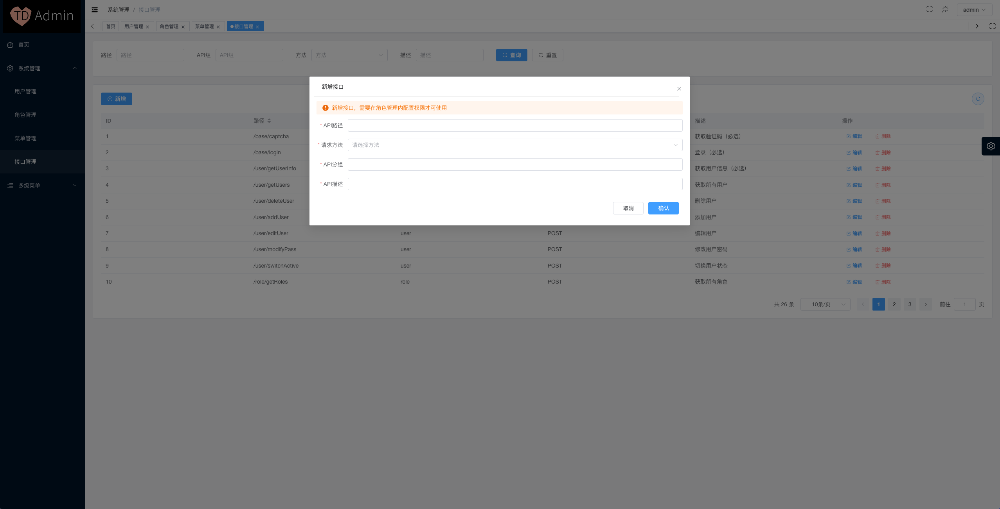
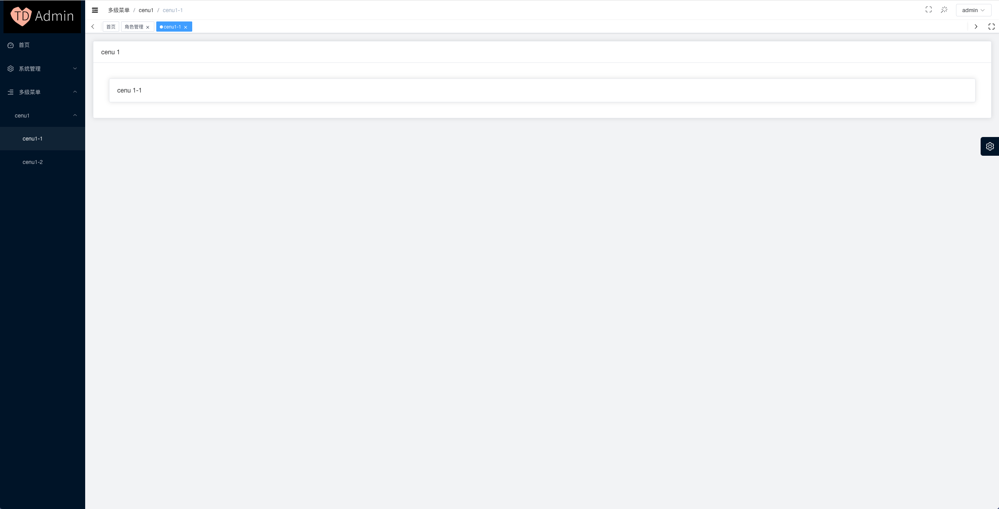

<h1 align="center" style="margin: 30px 0 30px; font-weight: bold;">TD27 Admin</h1>
<h4 align="center">基于Gin+Vue3前后端分离的Golang快速开发框架</h4>

## 平台简介

* 前端技术栈 TypeScript、Vue3、Element-Plus、Vite、Pinia
* 后端技术栈 Golang、Gin、Gorm、MySQL、Redis、Casbin

## 内置功能

- 权限管理：登录认证 `jwt`，后端接口认证 `casbin`。
- 角色管理：分配权限控制的对象，不可角色可分配不同的菜单和后端接口权限。
- 菜单管理：根据用户角色动态分配菜单配置，实现不同角色不同菜单。
- api管理：不同角色可调用的api接口的权限不同。

## 运行

默认账号密码

admin/123456

克隆项目
`git clone https://github.com/pddzl/td27-admin.git`

### 前端

```bash
# 配置
1. 一键安装 .vscode 目录中推荐的插件
2. node 版本 17+
3. pnpm 版本 8.x

# 进入项目目录
cd web

# 安装依赖
pnpm i

# 启动服务
pnpm dev

# 预览预发布环境
pnpm preview:stage

# 预览正式环境
pnpm preview:prod

# 构建预发布环境
pnpm build:stage

# 构建正式环境
pnpm build:prod

# 代码格式化
pnpm lint
```

### 后端

```bash
# 配置
1. Go >= 1.19

# 进入server文件夹
cd server

# 使用 go mod 并安装go依赖包
go generate

# 编译 
go build -o server main.go (windows编译命令为go build -o server.exe main.go )

# 运行二进制
./server (windows运行命令为 server.exe)
```

## 一键安装

Docker Compose 版本需要 V2

```bash
git clone https://github.com/pddzl/td27-admin
cd td27-admin
docker-compose -f docker-compose/docker-compose.yml build
docker-compose -f docker-compose/docker-compose.yml up -d
```

浏览器打开 `http://ip:8500`

## 项目预览图

<table>
  <tr>
    <td></td>
    <td></td>
  </tr>
  <tr>
    <td></td>
    <td></td>
  </tr>
  <tr>
    <td></td>
    <td></td>
  </tr>
  <tr>
    <td></td>
    <td></td>
  </tr>
  <tr>
    <td></td>
    <td></td>
  </tr>
</table>

## 致谢
+ 项目脚手架 [v3-admin-vite](https://github.com/un-pany/v3-admin-vite)

## 📄 License

[MIT](./LICENSE)

Copyright (c) 2022-present [pddzl](https://github.com/pddzl)
