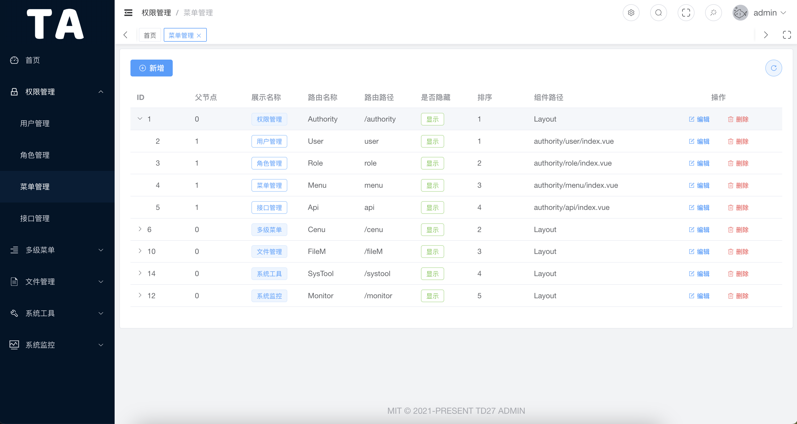

<div>
  <h1>TD27 Admin</h1>
  <h4>基于Gin+Vue3前后端分离的Golang快速开发框架</h4>
  <span><a href="./README.md">English</a> | 中文</span>
</div>

## 平台简介

* 前端技术栈 TypeScript、Vue3、Element-Plus、Vite、Pinia
* 后端技术栈 Golang、Gin、Gorm、MySQL、Redis、Casbin

## 内置功能

- 用户管理：用户是系统操作者，该功能主要完成系统用户配置。
- 角色管理：分配权限控制的对象，不可角色可分配不同的菜单和后端接口权限。
- 菜单管理：根据用户角色动态分配菜单配置，实现不同角色不同菜单。
- 接口管理：不同角色可调用的api接口的权限不同。
- 操作记录：详细记录用户访问接口的行为
- 定时任务：支持配置文件和页面配置。
- 水印设置：目前仅支持在前端设置。
- 文件管理：文件上传、下载、删除
- 字典管理：维护数据字典（支持嵌套），方便前端使用

## 运行

默认账号密码

`admin/123456`

克隆项目
`git clone https://github.com/pddzl/td27-admin.git`

### 前端

```bash
# 配置
1. 一键安装 .vscode 目录中推荐的插件
2. node 版本 18+
3. pnpm 版本 8.x

# 进入项目目录
cd web

# 安装依赖
pnpm i

# 启动服务
pnpm dev

# 预览预发布环境
pnpm preview:stage

# 预览正式环境
pnpm preview:prod

# 构建预发布环境
pnpm build:stage

# 构建正式环境
pnpm build:prod

# 代码格式化
pnpm lint
```

### 后端

```bash
# 配置
1. Go >= 1.25

# 进入server文件夹
cd server

# 使用 go mod 并安装go依赖包
go generate

# 编译 
go build -o server cmd/server/main.go

# 运行二进制
./server
```

#### 目录结构
```shell
├── cmd                      # Main application entry points (one folder per binary)
│   └── server               # Main HTTP server entry (main.go)
│
├── configs                  # Configuration files (YAML/JSON), config templates
│
├── docs                     # API docs, Swagger files, architecture docs
│
├── internal                 # Private application code (not for import by other modules)
│   ├── api                  # Request handlers (Gin handlers / controllers)
│   ├── core                 # Core startup logic (config load, logger, DB, server setup)
│   ├── global               # Global variables (DB, Redis, Config, Logger, etc.)
│   ├── initialize           # Init functions (router setup, config init, cron init)
│   ├── middleware           # Gin middleware
│   ├── model                # Data models: entity, request, response, VO, DTO
│   ├── pkg                  # Shared utilities (tools, common helpers, not business logic)
│   ├── router               # Router groups & route registration
│   └── service              # Business logic & database operations (service layer)
│
├── log                      # Application logs
│
├── resource                 # Static resources (images, attachments, templates)
│   └── upload               # File upload target directory
│
└── scripts                  # Shell scripts (build, deploy, maintenance)

```

**<u>如果选择手动部署，需要创建数据库 `td27` 并导入初始化数据。sql文件位置：`./docker-compose/mysql/init/init.sql` </u>**

## swagger

```bash
cd server
swag init
```

`浏览`

```bash
http://localhost:8888/swagger/index.html
```

## 一键安装

Docker Compose 版本需要 V2

```bash
git clone https://github.com/pddzl/td27-admin
cd td27-admin
docker-compose -f docker-compose/docker-compose.yml build
docker-compose -f docker-compose/docker-compose.yml up -d
```

浏览器打开 `http://ip:8500`

## 项目预览图

<table>
  <tr>
    <td></td>
    <td></td>
  </tr>
  <tr>
    <td></td>
    <td></td>
  </tr>
  <tr>
    <td></td>
    <td></td>
  </tr>
  <tr>
    <td></td>
    <td></td>
  </tr>
</table>

## 致谢
+ 项目前端脚手架 [v3-admin-vite](https://github.com/un-pany/v3-admin-vite)

## 📄 License

[MIT](./LICENSE)

Copyright (c) 2022-present [pddzl](https://github.com/pddzl)
